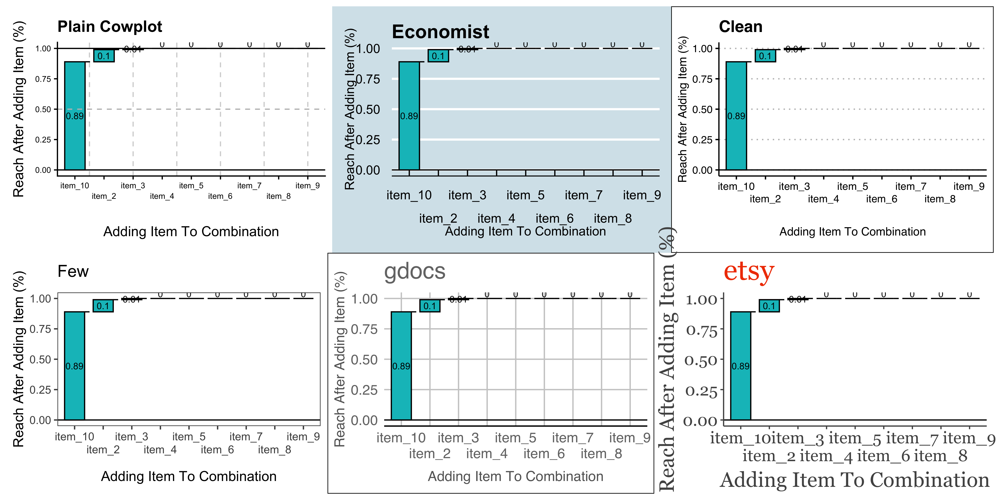

# Lukas Taylor Portfolio

Kaggle.com Awards:
1) Earned bronze metal for four seperate notebooks
2) .002272 RMSE away from first place on "Feature Imputation with a Heat Flux Dataset" competition
3) Top 20% in "House Prices - Advanced Regression Techniques" competition

Top Kaggle Projects:
1) [Visualizing Supermarket Sales With Seaborn](https://www.kaggle.com/code/lukastaylor2/visualizing-supermarket-sales-with-seaborn) - Demonstrated strong data visualization skills with supermarket sales data. (Bronze Metal)
2) [Non Alcohol Fatty Liver Disease - Decision Tree Investigations](https://www.kaggle.com/code/lukastaylor2/fatty-liver-decision-tree-investigations) - Showed flaws in dataset for machine learning tools due to lack of healthy data for elderly individuals. Using decision trees, I showed how machine learning tools will make decisions based on false assumptions if there are such problems with the dataset. Also showed how undersampling can solve some problems with imbalanced data.
3) [Regression - Vaccines And Death Rates](https://github.com/lukastay/Lukas-Taylor-Repository/blob/main/Regression%20Vaccines%20And%20Death%20Rates.ipynb) - Regression studying the effects of vaccine rates (first dose, booster, and series) on county level death rates.

Custom-Built Data Visualization And Analysis Tools:

1) [R Language: ggoutlierscatterplot Package](https://github.com/lukastay/ggoutlierscatterplot) - Created R package that detects outliers in 2D space and displays them in a scatterplot.

  
2) [Power BI: ScatterMatrix Custom Power BI Visual](https://github.com/lukastay/PowerBI-ScatterMatrix) - Coded custom visual to create a scatterplot matrix visual in Power BI.

2) [R Language: turfcata Package](https://github.com/lukastay/turfcata/tree/master) - R package built for visualizing and preparing TURF analysis, where combinations of marketing strategies based on "Check All That Apply" survey questions are evaluated. Advanced tree searching methods are used to hunt down combinations of marketing strategies that best suit a wide variety of individual interests.

 

Kaggle.com Notebooks:

1) [Titanic - Mass Testing Of Estimators](https://www.kaggle.com/code/lukastaylor2/titanic-mass-testing-of-estimators-v2) - This project leverages data on characteristics of people who survived the Titanic disaster to predict whether passengers with unknown data survived or did not survive. It mass-tests 20+ classifiers, and then tunes the hyperparamets of the best model. (Bronze metal)
2) [ Dermamtology - Fixing Inflated Accuracy Scores](https://www.kaggle.com/code/lukastaylor2/dermamtology-fixing-inflated-accuracy-scores) - Using decision tree analysis, this journal showed how low in-class variance for any given variable given to machine learning tools can cause inflated accuracy scores. With low in-class variance, a machine learning tool will simply predict a given result based on arbitrary data.
3) [Diabetes - 20+ Classifiers - 97%, 91% Undersample](https://www.kaggle.com/code/lukastaylor2/diabetes-20-classifiers-97-91-undrsmpl) - This project is about predicting whether a person has diabetes based on factors like gender, age, BMI, and others. first does exploratory data analysis and data visualizations. Then, it performs LASSO, a way of creating models with only the most significant variables. Next, I mass-test many scikit learn classifiers and tune the hyperparameters of the highest scoring classifier. (Bronze metal)
4) [ Heat Flux - Miceforest And Pycaret](https://www.kaggle.com/code/lukastaylor2/heat-flux-miceforest-and-pycaret) - This project attempts to predict critical heat flux values. First, the project uses feature imputation using Miceforest, which is a way of dealing with missing data by guessing variable values based on similar data with known values. Secondly, it tests 20+ regression techniques to predict heat flux values and tunes hyperparameters for the best regression model.
5) [House Prices - Catboost Hyperparameter Tune .12743](https://www.kaggle.com/code/lukastaylor2/house-prices-catboost-hyperparameter-tune-12743) - This model uses the "House Prices - Advanced Regression Techniques" dataset. For the competition associated with this dataset, we are supposed to predict house prices based on a variety of variables. After some preprocessing of the data, this journal tunes Catboost, a regression model. 
6) [Pakistan Houses - Many Regressors - LGBM Best](https://www.kaggle.com/code/lukastaylor2/pakistan-houses-many-regressors-lgbm-best) - This project uses housing data from Pakistan to predict housing prices. It finds Light Gradient Boosting Machine to be the most predictive.
7) [House Prices - Tensorflow Random Forest Autotuner](https://www.kaggle.com/code/lukastaylor2/house-prices-tensorflow-random-forest-autotuner) - This project uses the previvous housing prices dataset to tune Tensorflow Random Forest models.
8) [Fatty Liver - 20+ Classifiers - 92%, 74% Undersample](https://www.kaggle.com/code/lukastaylor2/fatty-liver-20-classifiers-92-74-undrsmpl) - This data finds problems for inflated accuracy scores in the Non-alcohol fatty liver disease dataset due to problems with the dataset having much more data for people without the disease than with the disease. Then, it "undersamples" the data, which is where you remove certain parts of the data in order to make a more representative dataset. Finally, it re-evaluates classifier scores using the undersampled data. (Bronze metal)

This is a portfolio of selected mini-projects I've done
1) [Power BI Dashboard On Sales Data](https://github.com/lukastay/Lukas-Taylor-Repository/blob/main/Example%20Power%20BI%20Dashboard.pdf) - Showed Power BI visualization and DAX skills using a Microsoft example data model
2) [Pythonreader](https://github.com/lukastay/Lukas-Taylor-Repository/blob/main/pythonreader.py) - This project searches the user's screen for sentences inside a PDF document. If it finds words on your screen that match with words in the PDF document, it will save the relevant page of the PDF document in a seperate file.
3) [ Backwards Regression](https://github.com/lukastay/Lukas-Taylor-Repository/blob/main/Backwards%20Regression.ipynb) - Backwards selection for regression analysis. Backwards selection chooses variables to use in a regression by testing which variables, when left out of a regression, raise the predictability of the model.
4) [ Finding latlong from zips or strings](https://github.com/lukastay/Lukas-Taylor-Repository/blob/main/Finding%20latlong%20from%20zips%20or%20strings%20with%20locations%20in%20middle) - Function to find the latitude and longitude for zip codes or strings that are containing a city but also other text
5) [ Machine Learning - Truckers Quitting](https://github.com/lukastay/Lukas-Taylor-Repository/blob/main/Machine%20Learning%20-%20Truckers%20Quitting.ipynb) - Machine learning project for analyzing data for trucker employment retention. Uses machine learning to predict whether a trucker will quit and what factors predict quitting
6) [Machine Learning Classification](https://github.com/lukastay/Lukas-Taylor-Repository/blob/main/Machine%20Learning%20Classifications.py) - Grouping variables with machine learning
7) [R - Visualization Final](https://github.com/lukastay/Lukas-Taylor-Repository/blob/main/R%20-%20Visualization%20Final.qmd) - Final for class where I visualized a dataset
8) [STATA - 2SLS Regression](https://github.com/lukastay/Lukas-Taylor-Repository/blob/main/STATA%20-%202SLS%20Regression.do) - Two-Stage Least Squares regression code for STATA
9) [STATA - Regression Visualization](https://github.com/lukastay/Lukas-Taylor-Repository/blob/main/STATA%20-%20Regression%20Visualization.do) - Visualizing multiple regressions
10) [ Sorting Sales By Style and Color](https://github.com/lukastay/Lukas-Taylor-Repository/blob/main/Sorting%20Sales%20By%20Style%20and%20Color.ipynb) - Sorting state-level data from Dilliards relational database by color, style, and size 
101) [GIS Distance Project - Data Preprocessing](https://github.com/lukastay/Lukas-Taylor-Repository/blob/main/GIS%20Distance%20Project%20-%20Data%20Preprocessing.ipynb)- Start of project where I use GIS information about visits to locations where we will use regression to see if shootings have an effect on visits to area
