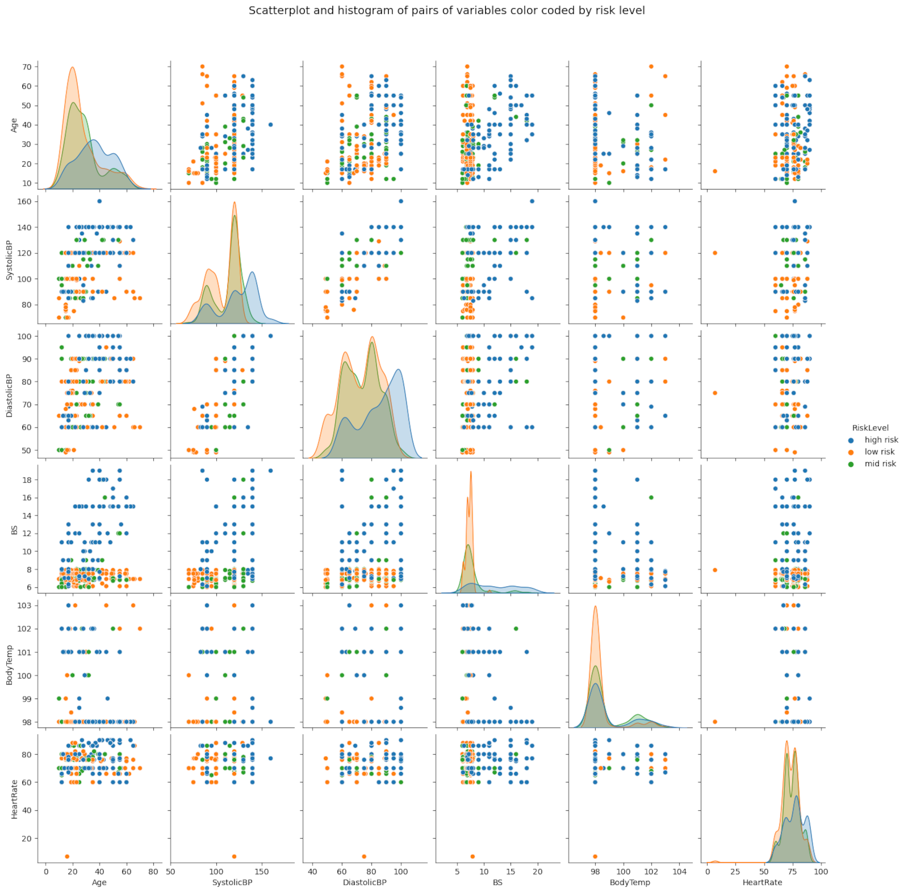

# Lukas Taylor Portfolio

## Kaggle.com Awards:
1) Earned bronze metal for four studies
2) .002272 RMSE away from first place on "Feature Imputation with a Heat Flux Dataset" competition
3) Top 20% in "House Prices - Advanced Regression Techniques" competition

## Custom-Built Data Visualization & Analysis Tools:

### 1) [R Language: ggoutlierscatterplot Package](https://github.com/lukastay/ggoutlierscatterplot)

Created R package that visualizes different algorithms for detecting outliers in two dimensional space with scatterplots.

  
### 2) [Programming For Power BI: ScatterMatrix Custom Power BI Visual](https://github.com/lukastay/PowerBI-ScatterMatrix) 

Coded custom visual in Power BI to create a scatterplot matrix visual from R code and visual basic programming.

### 3) [R Language: turfcata Package](https://github.com/lukastay/turfcata/tree/master) 

R package built for visualizing and preparing TURF analysis, where combinations of marketing strategies based on "Check All That Apply" survey questions are evaluated. Advanced tree searching methods are used to hunt down combinations of marketing strategies that best suit a wide variety of individual interests. Then, turfcata showcases these results in a table and a waterfall chart.

### 4) [R Language: ggautothemes](https://github.com/lukastay/ggautothemes/blob/master/README.md)

ggautothemes is an R package built to let users see how their ggplot2 chart would look with various themes in a quick manner. After a user selects a theme, they can output it to a professional-grade high-resolution raster image file.

## Selected Data Science Investigations:

### 1) [Regression Model Optimization - Vaccines And Death Rates](https://www.kaggle.com/lukastaylor2/vaccine-and-county-death-rates)

Regression studying the effects of vaccine rates (first dose, booster, and series) on county level death rates. Used various model selection tools, like backwards selection and LASSO to choose the best model.

   
### 2) [Non Alcohol Fatty Liver Disease Dataset - Decision Tree Investigations](https://www.kaggle.com/code/lukastaylor2/fatty-liver-decision-tree-investigations)

Showed flaws in dataset balance explain why other Kaggle users were getting inflated accuracy scores on their machine learning models. Also showed how oversampling can fix some of this issue.

### 3) [Power BI Dashboard On Sales Data](https://github.com/lukastay/Lukas-Taylor-Repository/blob/main/Example%20Power%20BI%20Dashboard.pdf) 

Showcased my Power BI visualization and DAX skills using a Microsoft example data model.

### 4) [Visualizing Supermarket Sales With Seaborn](https://www.kaggle.com/code/lukastaylor2/visualizing-supermarket-sales-with-seaborn)

Demonstrated strong data visualization skills with supermarket sales data. (Bronze Metal On Kaggle)

### 5) [Non Alcohol Fatty Liver Disease Dataset - Mass Classifier Testing And Undersampling](https://www.kaggle.com/code/lukastaylor2/fatty-liver-20-classifiers-92-74-undrsmpl) 

This data finds problems for inflated accuracy scores in the Non-alcohol fatty liver disease dataset due to problems with the dataset having much more data for people without the disease than with the disease. Then, it "undersamples" the data, which is where you remove certain parts of the data in order to make a more representative dataset. Finally, it re-evaluates classifier scores using the undersampled data. (Bronze metal)

### 6) [Titanic Survivor Dataset - Mass Testing Of Machine Learning Estimators](https://www.kaggle.com/code/lukastaylor2/titanic-mass-testing-of-estimators-v2)

This project leverages data on characteristics of people who survived the Titanic disaster to predict whether passengers with unknown data survived or did not survive. It mass-tests 20+ classifiers, and then tunes the hyperparamets of the best model. (Bronze Metal On Kaggle)

   
### 7) [ Dermamtology Dataset - Diagnosing The Dataset As Inflating Other Users' Machine Learning Scores](https://www.kaggle.com/code/lukastaylor2/dermamtology-fixing-inflated-accuracy-scores)

Using decision tree analysis, this journal showed how low in-class variance for any given variable given to machine learning tools can cause inflated accuracy scores. With low in-class variance, a machine learning tool will simply predict a given result based on arbitrary data.

### 8) [ Backwards Selection For Optimal Regression Modeling](https://www.kaggle.com/lukastaylor2/backwards-regression) 

Backwards selection for regression analysis. Backwards selection chooses variables to use in a regression by testing which variables, when left out of a regression, raise the predictability of the model.

   
### 9) [Diabetes Dataset - Classifier Testing And Undersampling](https://www.kaggle.com/code/lukastaylor2/diabetes-20-classifiers-97-91-undrsmpl)

This project focuses on predicting whether a person has diabetes based on factors like gender, age, BMI, and others. First, I do exploratory data analysis and data visualizations. Then, I performs LASSO, a way of creating models with only the most significant variables. Next, I mass-test many scikit learn classifiers and tune the hyperparameters of the highest scoring classifier. (Bronze metal)

### 10) [ Heat Flux Dataset - Hyperparameter Tuning Of Machine Learning Tools](https://www.kaggle.com/code/lukastaylor2/heat-flux-miceforest-and-pycaret) 

This project attempts to predict critical heat flux values. First, the project uses feature imputation using Miceforest, which is a way of dealing with missing data by guessing variable values based on similar data with known values. Secondly, it tests 20+ regression techniques to predict heat flux values and tunes hyperparameters for the best regression model.

  
### 11) [House Prices Dataset - Experiments In Visualizing Machine Learning Feature Space](https://www.kaggle.com/code/lukastaylor2/housing-prices-ml-visualization)

This project uses tensorflow to visualize both random forest and decision tree machine learning methods.

### 12) [Python Tutorial: Creating High Resolution Plots](https://www.kaggle.com/code/lukastaylor2/tutorial-high-resolution-plots/notebook) 

Tutorial for building high resolution plots in matplotlib and seaborn.

   
### 13) [Pythonreader](https://github.com/lukastay/Lukas-Taylor-Repository/blob/main/pythonreader.py) 

A python script that looks through PDFs for keywords that match words on a user's current computer screen.

### 14) [Pakistan Houses Dataset - Testing Many Regressors, Finds LGBM Is Best](https://www.kaggle.com/code/lukastaylor2/pakistan-houses-many-regressors-lgbm-best)

This project uses housing data from Pakistan to predict housing prices. It finds Light Gradient Boosting Machine to be the most predictive.

   
### 15) [STATA - 2SLS Regression On Settler Mortality And Education](https://github.com/lukastay/Lukas-Taylor-Repository/blob/main/STATA%20-%202SLS%20Regression.do) 

Two-Stage Least Squares regression code for STATA. Then, I visualize multiple regressions by year.

